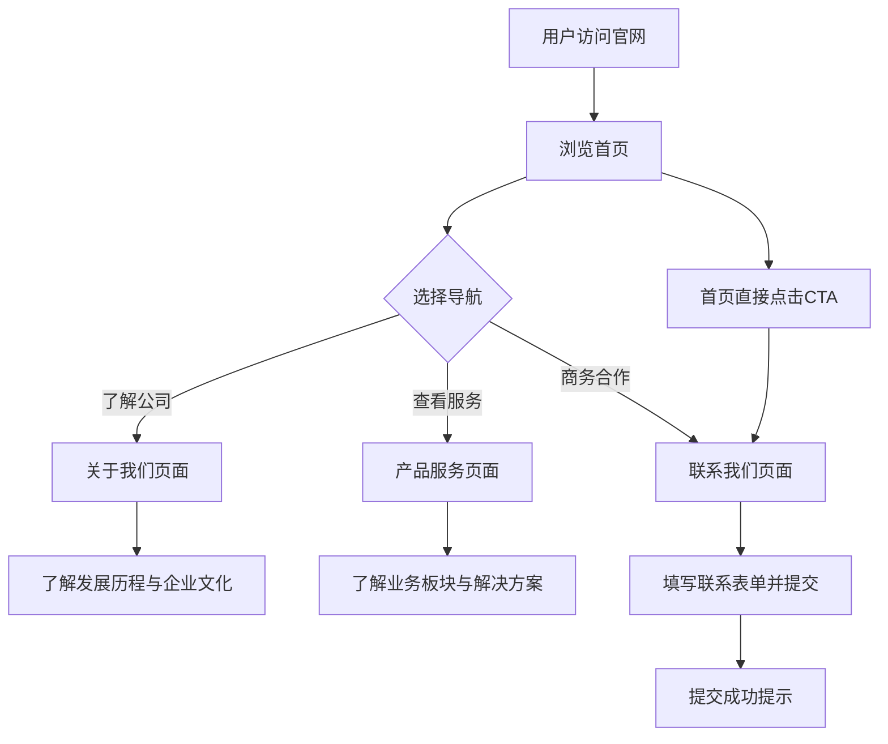

## 1. 产品概述

美点汇企业官网是一个展示 O2O 综合服务平台品牌形象与业务能力的官方站点。面向商家合作伙伴、消费者及潜在投资者，传递平台的业务模式、核心价值与联系方式，助力品牌信任建立与业务拓展。

- 核心目标：展示美点汇 O2O 平台品牌形象，介绍主营业务与服务能力，提供商务合作与客户咨询入口
- 目标用户：C端消费者、B端合作商家、潜在投资人/合作伙伴

## 2. 核心功能

### 2.1 功能模块

1. **首页**：Hero 主视觉区、O2O 核心优势展示、核心数据亮点、业务场景概览、合作品牌/伙伴展示
2. **关于我们**：企业介绍、发展历程（时间轴）、企业文化/价值观、团队风采
3. **产品服务**：O2O 业务板块介绍（线上商城、线下门店、配送物流、会员体系）、服务特色说明、场景化解决方案
4. **联系我们**：联系表单、公司地址与地图、联系方式（电话/邮箱/微信）、商务合作入口

### 2.2 页面详情

| 页面名称 | 模块名称 | 功能描述 |
|---------|---------|---------|
| 首页 | 导航栏 | 固定顶部导航，包含 Logo、页面链接、CTA 按钮，滚动时背景变色 |
| 首页 | Hero 主视觉 | 全屏大图轮播/静态展示，核心标语 + CTA 按钮，简约大气 |
| 首页 | 核心优势 | 三列卡片展示 O2O 核心优势（线上流量、线下体验、高效配送），配图标 |
| 首页 | 数据亮点 | 数字滚动动画展示平台关键数据（合作商家数、日订单量、覆盖城市等） |
| 首页 | 业务场景 | 图文交错展示 O2O 典型消费场景，突出线上线下融合 |
| 首页 | 合作伙伴 | Logo 墙滚动展示合作品牌 |
| 首页 | 页脚 | 公司信息、快速链接、社交媒体入口、版权信息 |
| 关于我们 | 页面 Banner | 简约标题 Banner，与首页风格统一 |
| 关于我们 | 企业简介 | 左右图文布局，介绍公司使命与愿景 |
| 关于我们 | 发展历程 | 垂直时间轴展示公司里程碑事件 |
| 关于我们 | 企业文化 | 卡片网格展示核心价值观（4-6项），配图标与说明 |
| 关于我们 | 团队风采 | 图片墙展示团队风貌 |
| 产品服务 | 页面 Banner | 简约标题 Banner |
| 产品服务 | 业务板块 | 大卡片展示四大业务板块，点击展开详情 |
| 产品服务 | 服务特色 | 图标+文字列表，展示平台差异化优势 |
| 产品服务 | 场景方案 | Tab 切换展示不同行业 O2O 解决方案 |
| 联系我们 | 页面 Banner | 简约标题 Banner |
| 联系我们 | 联系表单 | 姓名、电话、邮箱、咨询类型、留言内容，提交按钮 |
| 联系我们 | 公司信息 | 地址、电话、邮箱、工作时间等详细联系方式 |
| 联系我们 | 地图展示 | 嵌入地图展示公司位置 |

## 3. 核心流程

## 4. 用户界面设计

### 4.1 设计风格

- **主色调**：深蓝色 #1a1f36 为主色，金色 #c9a96e 为点缀色，传递专业、高端、可信赖的品牌调性
- **辅助色**：白色 #ffffff 为背景主色，浅灰 #f5f5f7 为区块底色，深灰 #333333 为正文色
- **按钮样式**：圆角矩形，主按钮金色填充白字，次按钮描边透明背景
- **字体**：标题使用思源宋体（Noto Serif SC）体现品质感，正文使用思源黑体（Noto Sans SC）保证阅读清晰度
- **布局风格**：宽屏居中最大宽度 1200px，大区块留白，卡片式信息展示，顶部固定导航
- **图标风格**：线性简约图标，与金色点缀色统一

### 4.2 页面设计概览

| 页面名称 | 模块名称 | UI 元素 |
|---------|---------|--------|
| 首页 | 导航栏 | 深色半透明背景，滚动后变为纯色，Logo 左对齐，链接右对齐，CTA 按钮金色高亮 |
| 首页 | Hero 区 | 全屏高度，深色渐变背景叠加产品场景图，大标题 + 副标题 + 双按钮，入场渐显动画 |
| 首页 | 核心优势 | 白色背景，三列卡片，图标 + 标题 + 描述，卡片微阴影，hover 上浮效果 |
| 首页 | 数据亮点 | 深蓝色背景，四列数字滚动动画，金色数字 + 白色标签 |
| 首页 | 业务场景 | 浅灰背景，左文右图/右文左图交替，大图圆角，文字区域简洁 |
| 首页 | 合作伙伴 | 白色背景，自动滚动 Logo 带，灰度处理 hover 变彩色 |
| 关于我们 | 全部 | 统一使用浅灰与白色交替区块，时间轴左侧金色竖线 + 圆点 |
| 产品服务 | 业务板块 | 大卡片带悬浮阴影，图标居中，点击展开更多详情 |
| 联系我们 | 表单 | 左表单右信息布局，表单字段简洁，提交按钮金色全宽 |

### 4.3 响应式设计

- 桌面端优先设计（1200px 最大宽度居中）
- 平板端（768px-1024px）：卡片列数减少，导航可折叠为汉堡菜单
- 手机端（<768px）：单列布局，Hero 高度自适应，时间轴简化，卡片全宽

## 5. 非功能性需求

- 页面加载性能：首屏加载 < 2 秒
- SEO 友好：语义化 HTML 标签，Meta 信息完善
- 无障碍访问：图片 Alt 文本，表单 Label 关联
- 浏览器兼容：Chrome、Firefox、Safari、Edge 最新版本