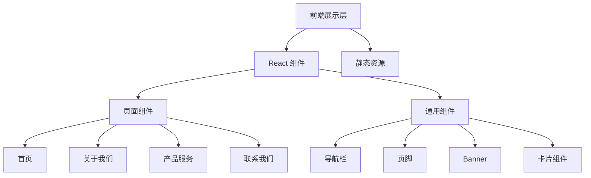

## 1. 架构设计



本项目为纯前端静态网站，无需后端服务与数据库。所有内容通过静态数据配置渲染。

## 2. 技术选型

- **前端框架**：React@18 + TypeScript
- **样式方案**：Tailwind CSS@3
- **构建工具**：Vite
- **路由**：React Router v6
- **动画**：CSS Animations + Intersection Observer（滚动触发动画）
- **图标**：Lucide React（轻量开源图标库）
- **字体**：Google Fonts（Noto Serif SC + Noto Sans SC）
- **后端**：无（纯静态站点）
- **数据库**：无（静态数据文件）

## 3. 路由定义

| 路由 | 页面 | 说明 |
|------|------|------|
| / | 首页 | 官网首页，Hero + 优势 + 数据 + 场景 + 合作伙伴 |
| /about | 关于我们 | 企业介绍、发展历程、企业文化、团队风采 |
| /services | 产品服务 | 业务板块、服务特色、场景方案 |
| /contact | 联系我们 | 联系表单、公司信息、地图 |

## 4. 项目结构

```
src/
├── components/
│   ├── layout/
│   │   ├── Navbar.tsx         # 顶部导航栏
│   │   └── Footer.tsx         # 页脚
│   ├── common/
│   │   ├── PageBanner.tsx     # 页面通用 Banner
│   │   ├── SectionTitle.tsx   # 区块标题
│   │   └── ScrollReveal.tsx   # 滚动动画包装组件
│   └── home/
│       ├── HeroSection.tsx    # Hero 主视觉
│       ├── Advantages.tsx     # 核心优势
│       ├── Stats.tsx          # 数据亮点
│       ├── Scenarios.tsx      # 业务场景
│       └── Partners.tsx       # 合作伙伴
├── pages/
│   ├── Home.tsx               # 首页
│   ├── About.tsx              # 关于我们
│   ├── Services.tsx           # 产品服务
│   └── Contact.tsx            # 联系我们
├── data/
│   ├── navigation.ts          # 导航数据
│   ├── home.ts                # 首页静态数据
│   ├── about.ts               # 关于我们数据
│   ├── services.ts            # 产品服务数据
│   └── contact.ts             # 联系我们数据
├── App.tsx
├── main.tsx
└── index.css
```

## 5. 数据模型

由于为纯静态站点，数据以 TypeScript 常量文件形式存储于 `src/data/` 目录：

### 导航数据
```typescript
interface NavItem {
  label: string;
  path: string;
}
```

### 首页数据
```typescript
interface HeroData {
  title: string;
  subtitle: string;
  ctaText: string;
  ctaLink: string;
}

interface Advantage {
  icon: string;
  title: string;
  description: string;
}

interface Stat {
  value: number;
  suffix: string;
  label: string;
}

interface Scenario {
  title: string;
  description: string;
  image: string;
  reverse: boolean;
}

interface Partner {
  name: string;
  logo: string;
}
```

### 联系我们表单
```typescript
interface ContactForm {
  name: string;
  phone: string;
  email: string;
  type: string;
  message: string;
}
```